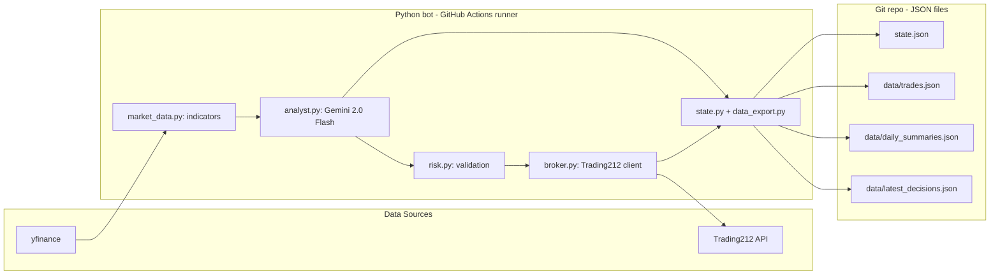

# Trading Bot

Autonomous intraday paper-trading bot. Python + Google Gemini 2.0 Flash + Trading212 demo API, scheduled on GitHub Actions cron, with state persisted as JSON in Git. Paper trading only.

---

## What it does

Every 30 minutes during US market hours (Monday–Friday, 14:30–21:00 UTC), a GitHub Actions workflow:

1. Fetches recent OHLCV data and computes technical indicators (RSI, MACD, Bollinger Bands, SMA, ATR) for a diversified five-stock watchlist.
2. Sends the **last ten candles** of indicator history to Google Gemini 2.0 Flash with a structured-output prompt.
3. Validates Gemini's JSON response against a schema. On parse failure the decision is dropped, never trusted raw.
4. Runs the proposed action (`BUY`, `SELL`, or `HOLD`) through a multi-check risk manager (confidence threshold, daily loss limit, cumulative drawdown from peak, max open positions, max position value, duplicate-position guard, etc.).
5. Executes approved orders against the Trading212 demo REST API.
6. Updates `state.json` and the `data/` JSON files, then commits them back to the repo so the run history is fully versioned.

Stop-loss and take-profit checks run at the start of every cycle for any open position before the model is consulted.

---

## Architecture



Everything runs on GitHub. There is no external server, database, or paid infrastructure.

---

## Tech stack

| Layer | Technology | Cost |
|---|---|---|
| Market data | `yfinance` + `ta` | Free |
| AI decisions | Google Gemini 2.0 Flash (structured JSON output) | Free tier (1,500 req/day) |
| Trade execution | Trading212 REST API, demo environment, Basic auth | Free |
| HTTP client | `httpx` (sync, with manual retry/backoff) | — |
| Bot runtime | GitHub Actions scheduled cron | Free (2,000 min/month) |
| Data store | JSON files committed to Git | Free, full version history |
| Secrets | GitHub repository secrets | Free |
| AI code review | `anthropic/claude-code-action` on pull requests | Pay-per-use |

---

## Repository layout

```
.
├── bot/
│   ├── main.py             # entrypoint: orchestrates the full decision cycle
│   ├── config.py           # dataclass-based config + watchlist + risk knobs
│   ├── market_data.py      # yfinance + ta: candles and indicator history
│   ├── analyst.py          # Gemini integration with schema-validated JSON
│   ├── risk.py             # multi-check validator (loss, drawdown, sizing, ...)
│   ├── broker.py           # Trading212 demo REST client (Basic auth, retries)
│   ├── state.py            # in-memory state helpers + atomic save/load
│   └── data_export.py      # writes data/trades.json, daily_summaries.json,
│                           # latest_decisions.json for downstream consumption
├── data/
│   ├── trades.json         # append-only trade ledger (BUY, SELL, P&L)
│   ├── daily_summaries.json# per-day P&L, peak, drawdown
│   └── latest_decisions.json # most recent decision per ticker (executed or not)
├── design/
│   ├── OVERVIEW.md         # high-level project doc
│   ├── ARCHITECTURE.md     # contracts, schemas, env vars
│   └── phase-1 ... phase-7 # incremental build phases
├── .github/workflows/
│   ├── trade.yml           # scheduled bot run (every 30 min, mkt hours)
│   └── claude-code-review.yml # AI code-review assistant on pull requests
├── state.json              # runtime state: positions, P&L, peak, last_run
├── requirements.txt
├── .env.example
└── CLAUDE.md               # project context for the Claude Code review agent
```

---

## Quick start (local)

Requires Python 3.11+.

```bash
git clone https://github.com/rionaNazareth/Trading-Bot.git
cd Trading-Bot

python3.11 -m venv .venv
source .venv/bin/activate
pip install -r requirements.txt

cp .env.example .env
# Fill in TRADING212_API_KEY, TRADING212_API_SECRET (demo account) and
# GEMINI_API_KEY (https://aistudio.google.com/apikey).

python -m bot.main
```

The bot will read `state.json`, run one decision cycle against the watchlist, and write any trades + state changes back to disk.

---

## Configuration

All runtime knobs live on the `Config` dataclass in `bot/config.py`. Defaults:

| Knob | Default | Meaning |
|---|---|---|
| `watchlist` | 5 tickers across 5 sectors (`AAPL`, `JPM`, `XOM`, `JNJ`, `WMT`) | Avoids correlated positions |
| `max_position_value` | `$100` | Hard cap per position |
| `max_open_positions` | `3` | Concurrent positions ceiling |
| `max_daily_loss` | `-$50` | Blocks new BUYs once breached |
| `max_drawdown` | `-$150` from peak P&L | Halts trading on slow bleed |
| `confidence_threshold` | `0.7` | Minimum Gemini-reported confidence to act |
| `default_stop_loss_pct` | `3 %` | Used when the model does not provide one |
| `default_take_profit_pct` | `5 %` | Used when the model does not provide one |
| `indicator_history_length` | `10` candles | Window sent to Gemini for trend / divergence |

### Environment variables

| Variable | Purpose |
|---|---|
| `TRADING212_API_KEY` | Trading212 demo API key id |
| `TRADING212_API_SECRET` | Trading212 demo API secret |
| `TRADING212_ENVIRONMENT` | `demo` (default). The bot will refuse anything else. |
| `GEMINI_API_KEY` | Google AI Studio API key for Gemini 2.0 Flash |

Secrets in CI are stored as **repository secrets**, not committed to the repo. Locally they live in `.env`, which is `.gitignore`d.

---

## Decision flow

Each scheduled run executes the same cycle inside `bot.main.run`:

1. **Stop-loss / take-profit sweep** for every open position. If the latest price has crossed either band, the position is closed before any model call.
2. **Per-ticker analysis loop** for the watchlist:
   - Pull `indicator_history_length` candles of OHLCV + indicators.
   - Build a structured prompt and call Gemini for an `action`, `confidence`, `quantity`, `stop_loss`, `take_profit`, and `reasoning`.
   - Schema-validate the response. Drop on parse failure.
   - Reject duplicate `BUY` (already holding) before risk validation.
   - Run the risk validator — confidence threshold, daily loss, drawdown from peak, max positions, position sizing, valid action, etc.
   - On approval, place the order via Trading212. On execution, persist position + trade + indicators snapshot.
3. **Cumulative P&L tracking**: roll daily P&L into cumulative, update peak P&L, recompute drawdown, persist `state.json`, and write `data/latest_decisions.json` + `data/daily_summaries.json` for downstream consumption.

Every decision (executed or not) is logged with the rejection reason, so the dataset can be inspected after the fact.

---

## Why these design choices

| Decision | Why |
|---|---|
| Gemini 2.0 Flash, not a trained ML model | No training data or GPU, free tier, structured JSON output, contextual reasoning over indicators |
| Send 10 candles, not the latest snapshot | A single bar cannot show trend, momentum, or divergence — the model needs sequence context to be useful |
| Diversified five-sector watchlist | Three tech stocks would be one large bet on tech; sector spread keeps risk uncorrelated |
| Cumulative drawdown check on top of daily loss | A daily limit alone does not catch slow bleed across multiple days |
| GitHub Actions instead of a VPS | Free, zero ops, and a 30-minute cadence does not need a long-running process |
| JSON files in Git instead of a database | Free, full version history for free, easy to read from a static frontend over `raw.githubusercontent.com` |
| Demo environment only | The goal is to learn agentic LLM trading patterns, not to lose real money to my own bot |

---

## CI / CD

### `trade.yml` — scheduled bot run

Runs every 30 minutes, Monday to Friday, 14:30–21:00 UTC. Installs dependencies, runs `python -m bot.main` with the secrets in env, then commits any updates to `state.json` and `data/` back to `main` via a rebased push from a `trading-bot` git identity.

### `claude-code-review.yml` — AI code-review assistant

`anthropic/claude-code-action@v1` is wired to PRs and `@claude` mentions. It reads the diff and the repo (including `CLAUDE.md` for project context), then posts review comments focusing on:

- Resilience to malformed Gemini output (schema validation, fallbacks).
- Trading212 API auth, retries, and rate-limit handling.
- State persistence correctness.
- Secret handling and any logging that might leak keys.
- Indicator math correctness.
- Test coverage gaps and obvious edge cases.

This is a second agentic LLM integration in the repo, alongside the Gemini decision loop.

---

## Status

Active development. The Python bot, risk manager, scheduler, and Claude Code review workflow are in place. Extensions on the design docs (backtesting harness, dashboard, deployment polish) are tracked under `design/phase-*.md` and built incrementally.

Pull requests are reviewed by the Claude Code action before merge.

---

## License

No license has been set. Treat the code as **all rights reserved** for now. If you would like to use any of it, open an issue.
