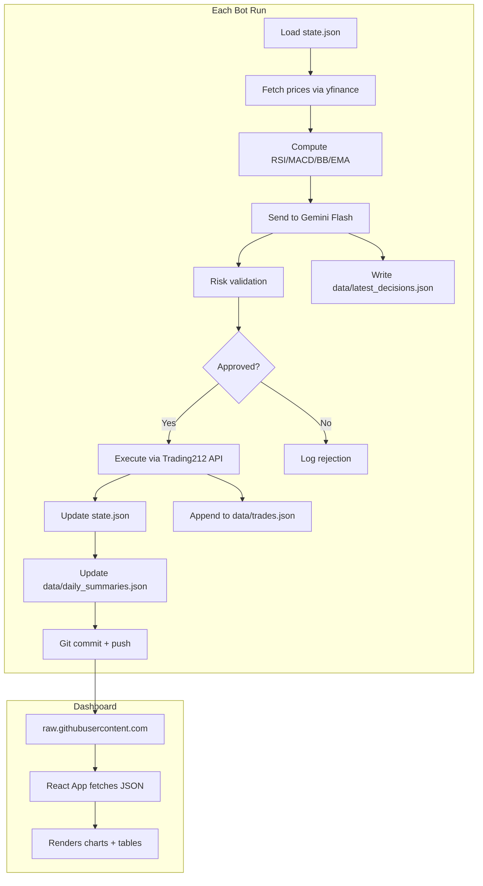

# Architecture — Technical Specification

This document defines the technical contracts for the entire project. No implementation code here — just structure, schemas, and interfaces. Phase docs reference this for data formats.

## Project Directory Tree

```
trading-bot/
├── bot/
│   ├── __init__.py           # Empty, makes bot/ a package
│   ├── config.py             # Config dataclass, loaded from env vars
│   ├── market_data.py        # yfinance price fetch + ta indicator computation
│   ├── analyst.py            # Gemini Flash prompt + structured JSON parsing
│   ├── broker.py             # Trading212 REST client with Basic auth
│   ├── risk.py               # Pre-trade risk validation (8 checks)
│   ├── data_export.py        # Write dashboard data files (trades, summaries, decisions)
│   ├── state.py              # Read/write state.json, position tracking
│   └── main.py               # Orchestrator entry point
├── data/
│   ├── trades.json           # Cumulative trade history (append-only)
│   ├── daily_summaries.json  # One entry per trading day
│   └── latest_decisions.json # Most recent Gemini decisions per stock
├── dashboard/
│   ├── public/
│   ├── src/
│   │   ├── components/       # Reusable UI components
│   │   ├── pages/            # Route-level page components
│   │   ├── hooks/            # Data fetching hooks
│   │   ├── types/            # TypeScript interfaces
│   │   ├── lib/              # Config and utilities
│   │   ├── App.tsx           # Router setup
│   │   ├── main.tsx          # React entry point
│   │   └── index.css         # Tailwind directives
│   ├── index.html
│   ├── package.json
│   ├── vite.config.ts
│   ├── tailwind.config.js
│   ├── postcss.config.js
│   └── tsconfig.json
├── .github/
│   └── workflows/
│       ├── trade.yml             # Bot: runs every 30 min
│       └── deploy-dashboard.yml  # Dashboard: builds + deploys to Pages
├── state.json                # Bot internal state (positions, daily P&L)
├── requirements.txt          # Python dependencies
├── .env.example              # Environment variable template
├── .gitignore
└── README.md
```

## Data Flow



## External Services

| Service | Base URL | Auth | Rate Limits | Used For |
|---------|----------|------|-------------|----------|
| Trading212 API | `https://{demo\|live}.trading212.com/api/v0` | Basic auth: `base64(api_key:api_secret)` | Varies by endpoint | Order execution, positions |
| Google Gemini | Via `google-generativeai` SDK | API key | Free: 15 RPM, 1,500 RPD | Buy/sell/hold decisions |
| yfinance | Yahoo Finance (no base URL, Python lib) | None | Unofficial, no hard limit | Price history, candles |
| GitHub Raw | `https://raw.githubusercontent.com/{owner}/{repo}/{branch}/` | None (public repo) | CDN-cached | Dashboard data source |

## Environment Variables

| Variable | Required | Example | Description |
|----------|----------|---------|-------------|
| `TRADING212_API_KEY` | Yes | `20503749Zsx...` | Trading212 API key ID |
| `TRADING212_API_SECRET` | Yes | `xCWpqYpes...` | Trading212 API secret |
| `TRADING212_ENVIRONMENT` | No (default: `demo`) | `demo` or `live` | Trading environment |
| `GEMINI_API_KEY` | Yes | `AIzaSy...` | Google Gemini API key |

## Data Schemas

### state.json — Bot Internal State

```json
{
    "positions": [
        {
            "ticker": "AAPL_US_EQ",
            "quantity": 5,
            "entry_price": 185.42,
            "entry_time": "2026-02-26T14:30:00Z",
            "stop_loss": 179.85,
            "take_profit": 194.69
        }
    ],
    "daily_pnl": -12.50,
    "trading_day": "2026-02-26",
    "trade_history": [
        {
            "ticker": "AAPL_US_EQ",
            "action": "BUY",
            "quantity": 5,
            "price": 185.42,
            "time": "2026-02-26T14:30:00Z",
            "reasoning": "RSI at 28 with MACD crossover..."
        }
    ],
    "last_run": "2026-02-26T15:00:00Z",
    "cumulative_pnl": 25.30,
    "peak_pnl": 40.00
}
```

- `positions`: Currently open positions (managed by the bot)
- `daily_pnl`: Running P&L for the current trading day (resets each morning)
- `trading_day`: Date string, used to detect new-day resets
- `trade_history`: Trades made TODAY (cleared on new day) — used for daily logic only
- `last_run`: ISO timestamp of the most recent bot run
- `cumulative_pnl`: Running total P&L across all trading days
- `peak_pnl`: Highest cumulative_pnl ever reached — used with `max_drawdown` to halt trading if drawdown from peak exceeds threshold

### data/trades.json — Cumulative Trade History (Dashboard)

Append-only. Never cleared. One entry per trade.

```json
[
    {
        "id": "2026-02-26T14:30:00Z_AAPL_US_EQ_BUY",
        "ticker": "AAPL_US_EQ",
        "yf_symbol": "AAPL",
        "action": "BUY",
        "quantity": 5,
        "price": 185.42,
        "value": 927.10,
        "time": "2026-02-26T14:30:00Z",
        "reasoning": "RSI at 28 with MACD crossover, price bouncing off lower Bollinger Band",
        "confidence": 0.82,
        "indicators": {
            "rsi_14": 28.3,
            "macd": -0.82,
            "macd_signal": -0.45,
            "macd_histogram": -0.37,
            "bb_pct": 0.12,
            "ema_trend": "bearish"
        },
        "stop_loss": 179.85,
        "take_profit": 194.69,
        "pnl": null
    }
]
```

- `id`: Unique key composed of `{time}_{ticker}_{action}`
- `pnl`: Set to the realized P&L on SELL trades, null on BUY trades
- `indicators`: Snapshot of key indicators at time of trade (subset, not all fields)
- `confidence`: Model's confidence (null for stop-loss/take-profit triggered sells)

### data/daily_summaries.json — Daily Performance (Dashboard)

One entry per trading day. Updated (upserted) at end of each run.

```json
[
    {
        "date": "2026-02-26",
        "pnl": 13.40,
        "cumulative_pnl": 13.40,
        "trades_count": 4,
        "buys": 2,
        "sells": 2,
        "wins": 1,
        "losses": 1,
        "win_rate": 0.50,
        "best_trade_pnl": 13.40,
        "worst_trade_pnl": -5.20,
        "positions_open": 1
    }
]
```

- `cumulative_pnl`: Sum of all daily P&Ls up to and including this day
- `win_rate`: `wins / (wins + losses)`, 0 if no closed trades
- Array is sorted by date ascending

### data/latest_decisions.json — Most Recent Model Decisions (Dashboard)

Overwritten each run. Shows Gemini's decision for every watchlist stock.

```json
{
    "run_time": "2026-02-26T15:00:00Z",
    "decisions": [
        {
            "ticker": "AAPL_US_EQ",
            "yf_symbol": "AAPL",
            "action": "BUY",
            "confidence": 0.82,
            "reasoning": "RSI at 28 with MACD crossover...",
            "was_executed": true,
            "rejection_reason": null,
            "indicators": {
                "current_price": 185.42,
                "rsi_14": 28.3,
                "macd": -0.82,
                "macd_signal": -0.45,
                "macd_histogram": -0.37,
                "bb_upper": 190.2,
                "bb_middle": 185.0,
                "bb_lower": 179.8,
                "bb_pct": 0.12,
                "ema_9": 184.1,
                "ema_21": 185.9,
                "ema_trend": "bearish",
                "volume": 52341000,
                "price_change_pct": -0.8
            }
        }
    ]
}
```

- `was_executed`: Whether the decision passed risk checks and was sent to Trading212
- `rejection_reason`: Why risk manager rejected it (null if executed or HOLD)

## Indicators Dict — Internal Contract

Returned by `market_data.fetch_indicators()`, consumed by `analyst.get_trading_decision()`. Contains two keys: `current` (latest candle, full detail) and `history` (last N candles, key indicators for trend analysis).

```python
{
    "current": {
        "symbol": "AAPL",
        "current_price": 185.42,
        "volume": 52341000,
        "rsi_14": 34.5,
        "macd": -0.82,
        "macd_signal": -0.45,
        "macd_histogram": -0.37,
        "bb_upper": 190.2,
        "bb_middle": 185.0,
        "bb_lower": 179.8,
        "bb_pct": 0.65,
        "bb_width": 0.054,
        "ema_9": 184.1,
        "ema_21": 185.9,
        "ema_trend": "bearish",
        "atr_14": 1.85,
        "obv_trend": "rising",
        "price_change_pct": -0.8
    },
    "history": [
        {"price": 186.3, "volume": 48000000, "rsi_14": 42.1, "macd_histogram": -0.12, "bb_pct": 0.52, "ema_9": 187.0, "ema_21": 186.7},
        {"price": 185.0, "volume": 50000000, "rsi_14": 34.5, "macd_histogram": -0.37, "bb_pct": 0.65, "ema_9": 184.1, "ema_21": 185.9}
    ]
}
```

## Gemini Decision Dict — Internal Contract

Returned by `analyst.get_trading_decision()`, consumed by `risk.validate_decision()`.

```python
{
    "action": "BUY",
    "confidence": 0.82,
    "quantity": 5,
    "reasoning": "RSI at 28 indicates oversold...",
    "stop_loss": 179.85,
    "take_profit": 194.69
}
```

## Python Dependencies

| Package | Min Version | Purpose |
|---------|-------------|---------|
| yfinance | 0.2.36 | Price history from Yahoo Finance |
| ta | 0.11.0 | Technical analysis indicators |
| google-generativeai | 0.8.0 | Gemini API client |
| httpx | 0.27.0 | HTTP client for Trading212 |
| python-dotenv | 1.0.0 | Load .env files |

## Dashboard Dependencies

| Package | Purpose |
|---------|---------|
| react, react-dom | UI framework |
| react-router-dom | Client-side routing |
| recharts | P&L charts, bar charts, pie charts |
| lightweight-charts | TradingView-style financial charts |
| lucide-react | Icon library |
| tailwindcss, postcss, autoprefixer | Styling |
| vite, @vitejs/plugin-react | Build tool |
| typescript | Type safety |
