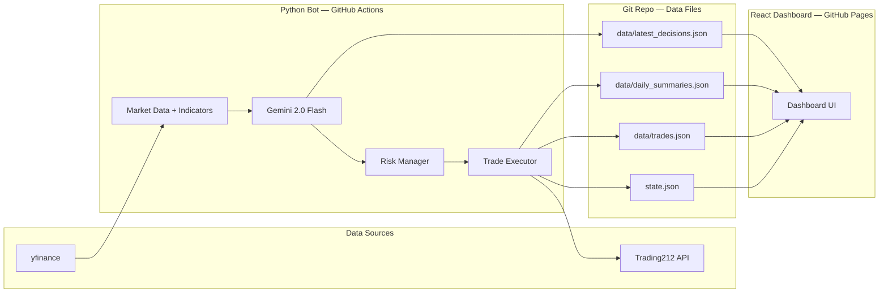

# Trading Bot — Project Overview

## What Is This

An autonomous intraday trading bot that runs on GitHub Actions every 30 minutes during market hours. It uses Google Gemini 2.0 Flash (free tier) to analyze technical indicators and make buy/sell/hold decisions, then executes trades via the Trading212 API. A React dashboard deployed on GitHub Pages provides real-time visibility into positions, trade history, AI reasoning, and performance analytics.

Everything runs on GitHub — no external servers, databases, or paid infrastructure.

## System Diagram

## Tech Stack

| Layer | Technology | Cost |
|-------|-----------|------|
| Market data | yfinance + ta (technical analysis) | Free |
| AI decisions | Google Gemini 2.0 Flash | Free tier (1,500 req/day) |
| Trade execution | Trading212 REST API (Basic auth) | Free |
| Bot runtime | GitHub Actions (scheduled cron) | Free (2,000 min/month) |
| Dashboard | React + TypeScript + TailwindCSS + Recharts | Free |
| Dashboard hosting | GitHub Pages | Free |
| Data storage | JSON files committed to Git | Free |
| Secrets | GitHub repository secrets | Free |

## Phase Map

| Phase | Document | What It Builds | Est. Effort |
|-------|----------|---------------|-------------|
| — | ARCHITECTURE.md | Tech contracts, schemas, diagrams | Reference doc |
| 1 | phase-1-setup.md | Project scaffold, config, broker client, state management | ~1 hour |
| 2 | phase-2-market-data.md | Price data + technical indicators + history for trend analysis | ~30 min |
| 3 | phase-3-ai-engine.md | Gemini integration + prompt engineering with indicator history | ~45 min |
| 4 | phase-4-orchestrator.md | Risk management (9 checks incl. drawdown), main flow, data export | ~1 hour |
| 4b | phase-4b-backtest.md | Simple backtesting on historical data (optional but recommended) | ~45 min |
| 5 | phase-5-automation.md | GitHub Actions trading workflow | ~20 min |
| 6 | phase-6-dashboard.md | Full React dashboard (20+ files) with loading/error states | ~2 hours |
| 7 | phase-7-deployment.md | GitHub Pages deployment + README | ~20 min |

Execute phases strictly in order (1 → 4 → 4b → 5 → 7). Phase 4b is optional but recommended. Each phase has a verification step that must pass before proceeding.

## Key Design Decisions

| Decision | Choice | Why |
|----------|--------|-----|
| AI model | Gemini 2.0 Flash (not traditional ML) | No training data/GPU needed, free tier, structured output, contextual reasoning |
| AI input | Indicator history (last 10 candles), not just latest | Enables trend, divergence, and momentum analysis — single-candle snapshots are insufficient per expert review |
| Watchlist | Diversified across 5 sectors | Avoids correlated positions (3 tech stocks = 1 large bet on tech) |
| Risk | 9 checks including cumulative drawdown | Daily loss limit alone doesn't prevent slow bleed over multiple days |
| Runner | GitHub Actions (not VPS) | Free, zero maintenance, good enough for 30-min intervals |
| Data store | JSON in Git (not a database) | Zero cost, version history for free, dashboard reads directly from raw.githubusercontent.com |
| Dashboard | Static React on GitHub Pages (not a backend) | Free hosting, no server to maintain, fetches data at runtime |
| Validation | Optional backtesting phase | Expert review: "Without backtests, you cannot know if the strategy has any edge" |

## Skills Showcased (Resume)

- LLM integration (Gemini structured output + prompt engineering)
- Autonomous agent (self-running bot with decision loop)
- API integration (Trading212 REST, yfinance, Gemini)
- Risk management system (multi-layered safety checks)
- React + TypeScript frontend with professional charting
- CI/CD and DevOps (GitHub Actions for automation + deployment)
- Data pipeline (bot → JSON → dashboard)
- Full-stack architecture (Python backend + TypeScript frontend + GitHub infra)

## How to Read These Docs

1. Start with **ARCHITECTURE.md** to understand the technical contracts (schemas, env vars, directory structure)
2. Follow **phase-1** through **phase-7** in order — each is self-contained with full code and a verification step
3. Do not skip phases — each depends on the previous one
