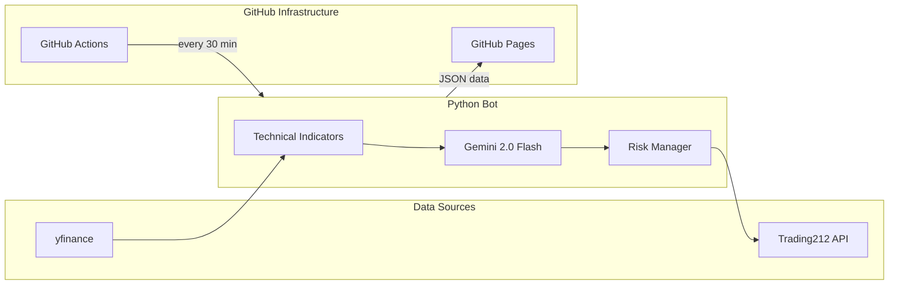

# Phase 7 — Deployment and README

## Goal

Deploy the React dashboard to GitHub Pages and create a comprehensive README that makes this project portfolio-ready.

## Depends On

- Phase 5: `.github/workflows/trade.yml` (bot runs on schedule)
- Phase 6: `dashboard/` exists and builds successfully

## Files to Create

### 1. `.github/workflows/deploy-dashboard.yml`

```yaml
name: Deploy Dashboard

on:
  push:
    paths:
      - 'dashboard/**'
      - 'data/**'
    branches:
      - main
  workflow_dispatch:

permissions:
  contents: read
  pages: write
  id-token: write

concurrency:
  group: "pages"
  cancel-in-progress: false

jobs:
  build:
    runs-on: ubuntu-latest
    steps:
      - name: Checkout
        uses: actions/checkout@v4

      - name: Setup Node
        uses: actions/setup-node@v4
        with:
          node-version: '20'
          cache: 'npm'
          cache-dependency-path: dashboard/package-lock.json

      - name: Install dependencies
        working-directory: dashboard
        run: npm ci

      - name: Build
        working-directory: dashboard
        run: npm run build

      - name: Upload artifact
        uses: actions/upload-pages-artifact@v3
        with:
          path: dashboard/dist

  deploy:
    needs: build
    runs-on: ubuntu-latest
    environment:
      name: github-pages
      url: ${{ steps.deployment.outputs.page_url }}
    steps:
      - name: Deploy to GitHub Pages
        id: deployment
        uses: actions/deploy-pages@v4
```

### 2. GitHub Pages Setup

1. Go to your repository on GitHub
2. Navigate to **Settings** → **Pages**
3. Under **"Build and deployment"**, set Source to **GitHub Actions**
4. Save

The workflow above handles the build and deploy automatically. The dashboard will be available at:

```
https://<your-username>.github.io/trading-bot/
```

### 3. `README.md`

```markdown
# Trading Bot

An autonomous intraday trading bot powered by Google Gemini 2.0 Flash. It analyzes technical indicators, makes AI-driven buy/sell decisions, and executes trades via the Trading212 API — all running on GitHub Actions with zero infrastructure.

**[Live Dashboard](https://<your-username>.github.io/trading-bot/)** | **[Trading212 API](https://t212public-api-docs.redoc.ly/)**

## Architecture



## Features

- **AI-Powered Decisions** — Gemini 2.0 Flash analyzes RSI, MACD, Bollinger Bands, and EMA to generate structured buy/sell/hold decisions with confidence scores
- **Risk Management** — Multi-layered safety: stop-loss, take-profit, position sizing, daily loss limits, and confidence thresholds
- **Real-Time Dashboard** — React + TypeScript frontend with dark trading-terminal theme, P&L charts, trade history with AI reasoning, and performance analytics
- **Fully Automated** — Runs on GitHub Actions every 30 minutes during market hours, no infrastructure to maintain
- **Zero Cost** — Uses free tiers only: GitHub Actions, Gemini API, GitHub Pages, yfinance

## Tech Stack

| Layer | Technology |
|-------|-----------|
| Market Data | yfinance + ta (technical analysis) |
| AI Engine | Google Gemini 2.0 Flash |
| Trade Execution | Trading212 REST API (Basic auth) |
| Automation | GitHub Actions (cron) |
| Dashboard | React + TypeScript + TailwindCSS + Recharts |
| Hosting | GitHub Pages |

## Setup

### 1. Clone and install

```bash
git clone https://github.com/<your-username>/trading-bot.git
cd trading-bot
pip install -r requirements.txt
```

### 2. Configure environment

```bash
cp .env.example .env
# Edit .env with your API keys
```

### 3. Run locally

```bash
python -m bot.main
```

### 4. Deploy

1. Push to GitHub
2. Add secrets in Settings → Secrets: `TRADING212_API_KEY`, `TRADING212_API_SECRET`, `GEMINI_API_KEY`
3. Enable GitHub Pages (Settings → Pages → Source: GitHub Actions)
4. The bot starts running on schedule, dashboard deploys automatically

## Dashboard Pages

| Page | Description |
|------|-------------|
| Dashboard | Summary cards, cumulative P&L chart, recent trades |
| Positions | Current open positions with entry prices and stop-loss/take-profit levels |
| Trade History | Full trade log with expandable AI reasoning for each trade |
| Performance | Win/loss analytics, daily P&L bar chart, statistics |
| Model Insights | Gemini's latest decisions with confidence bars and indicator snapshots |

## Skills Demonstrated

- **LLM Integration** — Structured output prompt engineering with Gemini
- **Autonomous Agent** — Self-running decision loop with no human intervention
- **API Integration** — Trading212 REST API, yfinance, Gemini API
- **Risk Management** — Multi-layered validation (8 safety checks)
- **React + TypeScript** — Professional dashboard with charting libraries
- **CI/CD** — GitHub Actions for both trading automation and dashboard deployment
- **Data Pipeline** — Bot → JSON → Dashboard data flow

## License

MIT
```

IMPORTANT: Replace all instances of `<your-username>` with your actual GitHub username.

---

## Final Verification Checklist

After completing this phase, verify the full system works end-to-end:

1. **Repository is public** — required for `raw.githubusercontent.com` data access and free GitHub Pages

2. **GitHub Secrets are set** (Settings → Secrets):
   - [ ] `TRADING212_API_KEY`
   - [ ] `TRADING212_API_SECRET`
   - [ ] `GEMINI_API_KEY`

3. **GitHub Pages is enabled** (Settings → Pages → Source: GitHub Actions)

4. **Trading bot runs** (Actions → Trading Bot → Run workflow):
   - [ ] Bot completes without errors
   - [ ] `state.json` is updated
   - [ ] `data/` files are populated
   - [ ] Commit appears from "trading-bot"

5. **Dashboard deploys** (push any change to `dashboard/` or `data/`):
   - [ ] Build succeeds in Actions
   - [ ] Dashboard is accessible at `https://<username>.github.io/trading-bot/`
   - [ ] All 5 pages load correctly
   - [ ] Data appears in the dashboard after bot has run at least once

6. **Dashboard config is correct**:
   - [ ] `dashboard/src/lib/config.ts` has correct GitHub username and repo name
   - [ ] `dashboard/vite.config.ts` has correct `base` path
   - [ ] `dashboard/src/main.tsx` has matching `basename`

## What's Next (Future Enhancements)

- **Phase 2 (MCP Server)**: Add an MCP server that exposes trading data to AI assistants
- **Backtesting**: Add a backtesting module to test strategies on historical data before live trading
- **Notifications**: Send alerts via Telegram or Discord on trades
- **Multi-market**: Support London, EU, and Asian market hours
- **Switch to live**: Change `TRADING212_ENVIRONMENT` to `live` after thorough demo testing
